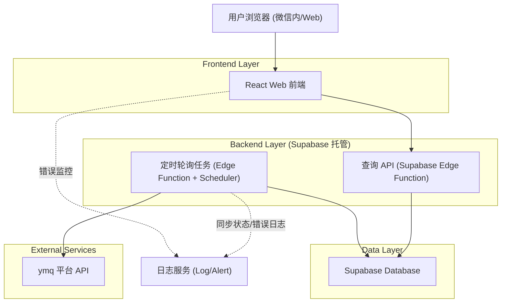
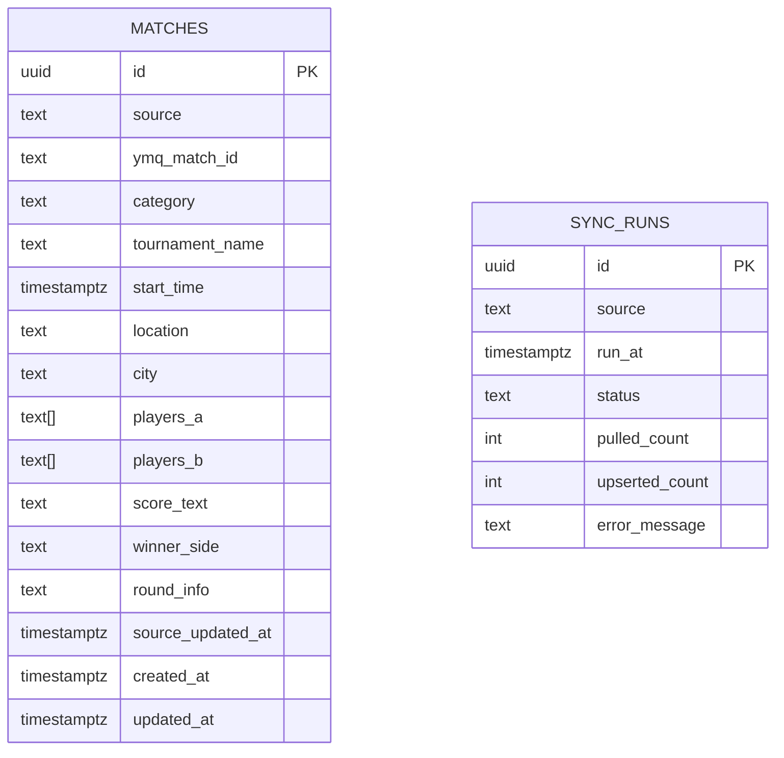

# MatchLife - 技术架构与可行性分析 (U系列轮询入库)

## 1. 架构设计 (Architecture Design)
基于第一阶段免登录、依托微信入口以及极简查询系统的需求，系统架构分为前端展现、查询服务和轮询服务三层。

### 1.1 系统数据流架构


### 1.2 技术选型 (Technology Description)
- **Frontend**: `React@18` + `Vite` + `TailwindCSS@3` + `Zustand`
- **Backend**: Supabase Edge Functions（无状态、弹性伸缩，提供查询与定时同步 API）
- **Database**: Supabase (PostgreSQL)

## 2. ymq 平台数据轮询策略与实现
### 2.1 智能轮询方案
- **频率控制**：每 6 小时轮询一次（例如：02:00, 08:00, 14:00, 20:00）。
- **增量更新**：基于上一次同步的 `last_update_timestamp` 拉取数据，避免全量覆盖。
- **失败重试**：失败后以 30 分钟、1 小时、2 小时的间隔进行递增重试。
- **数据去重**：使用 ymq_match_id (唯一标识符) 执行 `UPSERT` 逻辑。
- **请求优化**：合理设置 User-Agent、HTTP Keep-Alive 避免频繁建连。

### 2.2 核心同步逻辑 (Edge Function 伪代码)
```typescript
export async function pollYmqData() {
  const lastSync = await getLastSyncTime();
  const ymqData = await fetchYmqMatches(lastSync);
  
  for (const match of ymqData) {
    const cleaned = cleanMatchData(match);
    if (validateMatchData(cleaned)) {
      // 通过 ymqMatchId 实现 Upsert
      await upsertMatch(cleaned);
    }
  }
  await updateSyncStatus(ymqData.length, 'SUCCESS');
}

function cleanMatchData(rawData: any): MatchRecord {
  return {
    ymqMatchId: rawData.id,
    tournamentName: normalizeTournamentName(rawData.tournament),
    startTime: parseYmqTime(rawData.start_time),
    playersA: normalizePlayerNames(rawData.team_a),
    playersB: normalizePlayerNames(rawData.team_b),
    scoreText: formatScore(rawData.score),
    winnerSide: determineWinner(rawData),
    category: extractCategory(rawData.tournament),
    sourceUpdatedAt: rawData.updated_at
  };
}
```

## 3. 数据库设计 (Data Model)
数据模型聚焦最小必要字段，保证检索效率并控制存储成本。

### 3.1 实体关系图 (ER Diagram)


### 3.2 数据库定义语言 (DDL)
```sql
-- 比赛记录表
CREATE TABLE IF NOT EXISTS matches (
  id UUID PRIMARY KEY DEFAULT gen_random_uuid(),
  source TEXT NOT NULL DEFAULT 'ymq',
  ymq_match_id TEXT UNIQUE NOT NULL,
  category TEXT NOT NULL DEFAULT 'U',
  tournament_name TEXT NOT NULL,
  start_time TIMESTAMPTZ,
  location TEXT,
  city TEXT,
  players_a TEXT[] NOT NULL DEFAULT '{}',
  players_b TEXT[] NOT NULL DEFAULT '{}',
  score_text TEXT,
  winner_side TEXT CHECK (winner_side IN ('A', 'B', 'UNKNOWN')) DEFAULT 'UNKNOWN',
  round_info TEXT,
  source_updated_at TIMESTAMPTZ,
  created_at TIMESTAMPTZ NOT NULL DEFAULT NOW(),
  updated_at TIMESTAMPTZ NOT NULL DEFAULT NOW()
);

-- 性能索引
CREATE INDEX idx_matches_start_time_desc ON matches(start_time DESC);
CREATE INDEX idx_matches_tournament_name ON matches(tournament_name);
CREATE INDEX idx_matches_category ON matches(category);
CREATE INDEX idx_matches_players_a_gin ON matches USING GIN(players_a);
CREATE INDEX idx_matches_players_b_gin ON matches USING GIN(players_b);

-- 基础权限（第一阶段仅供只读公开数据）
GRANT SELECT ON matches TO anon;
GRANT ALL PRIVILEGES ON matches TO authenticated;

-- 同步记录状态表
CREATE TABLE IF NOT EXISTS sync_runs (
  id UUID PRIMARY KEY DEFAULT gen_random_uuid(),
  source TEXT NOT NULL DEFAULT 'ymq',
  run_at TIMESTAMPTZ NOT NULL DEFAULT NOW(),
  status TEXT NOT NULL, -- 'SUCCESS', 'FAILED'
  pulled_count INT NOT NULL DEFAULT 0,
  upserted_count INT NOT NULL DEFAULT 0,
  error_message TEXT
);

CREATE INDEX idx_sync_runs_run_at_desc ON sync_runs(run_at DESC);
GRANT SELECT ON sync_runs TO anon;
GRANT ALL PRIVILEGES ON sync_runs TO authenticated;
```

## 4. API 与路由设计 (API & Routing)

### 4.1 前端路由 (Frontend Routes)
| Route | 页面/组件说明 |
|-------|---------|
| `/` | 首页：全局搜索大框、筛选、列表、近期状态卡片 |
| `/matches/:id` | 比赛详情页：单场比赛比分、上下文关联 |
| `/player/:name` | 选手生涯页：选手档案、比赛历史轴、胜率图 |
| `/stats` | 统计看板页：核心指标统计表、近 30 天走势、数据同步面板 |

### 4.2 核心查询 API (RESTful)
```
GET /api/matches                 # 获取比赛列表（支持关键字、日期范围、选手等筛选）
GET /api/matches/:id             # 获取单场比赛详情
GET /api/players/:name/stats     # 获取选手历史比赛与胜率统计
GET /api/tournaments             # 获取赛事聚合列表
GET /api/stats/overview          # 获取U系列全局统计概览
GET /api/sync/status             # 获取最新同步日志
GET /api/export                  # 导出 CSV 数据
```

### 4.3 核心 TypeScript 类型
```typescript
export type MatchCategory = "U";

export type MatchRecord = {
  id: string;
  source: string;
  ymqMatchId: string;
  category: MatchCategory;
  tournamentName: string;
  startTime: string; // ISO String
  location?: string;
  city?: string;
  playersA: string[];
  playersB: string[];
  scoreText?: string;
  winnerSide?: "A" | "B" | "UNKNOWN";
  roundInfo?: string;
  sourceUpdatedAt?: string; 
};

export type SyncStatus = {
  lastRunAt?: string;
  lastSuccessAt?: string;
  lastError?: string;
  pulledCount?: number;
  upsertedCount?: number;
};
```

## 5. 成本与性能优化策略 (Performance & Cost)

### 5.1 性能优化
- **数据库查询**：对 `players_a` 和 `players_b` 采用 GIN 数组索引，极大提升基于选手名称的全文检索效率。
- **统计查询预聚合**：`count` 和 `distinct` 计算利用物化视图或缓存。
- **缓存策略**：热门搜索缓存 15 分钟；统计面板数据每小时刷新一次；选手个人数据缓存 30 分钟。

### 5.2 成本控制 (Supabase Free Tier)
- **数据库空间**：严格限制只存必须的维度和基础标识符字段，预计 10 万场比赛数据体积 < 100MB，完全满足免费额度。
- **API 请求**：每 6 小时轮询，每月边缘函数调用次数极少（约 120 次定时触发），留出足够额度给前端查询 API。
- **自动清理**：超过 2 年的比赛详情可触发归档策略，只保留汇总数据。

## 6. 错误处理与监控 (Error Handling & Monitoring)
- **同步异常**：记录至 `sync_runs` 表。若判定为可重试错误（网络超时等），进入指数退避队列；若为源接口结构变更错误，则停止并记录告警。
- **指标监控**：
  - 数据同步成功率 > 95%
  - API P95 响应时间 < 500ms
  - 数据新鲜度落后 < 6小时

## 7. 最小交付路径 (MVP Delivery Plan)
- **Week 1**：搭建前后端框架（Vite + React + Supabase）；部署 `ymq` 同步脚本打通数据写入；完成首页“极简搜索框”与比赛列表页面开发。
- **Week 2**：完成“比赛详情”、“选手生涯”、“统计监控看板”三个子页面；实现基于选手的搜索与数据导出（CSV）功能；接入微信公众号测试入口。